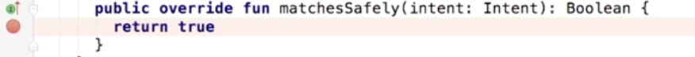

<h1>Android Espresso Practice Application - 🐱 Cat Names </h1> 

A Kotlin-based Android Application for learning some of the more advanced concepts of the Espresso framework for UI Testing. This application is the first of two applications exploring these concepts. The concepts covered in this repo are:
 - Intents
   - Incoming Intents
   - Outgoing Intents
  
The second application, *name*, can be accessed [here](). *name* covers hermetic test environments (Dependency Injections, Dagger).
<br>
_General Note:_ There are two packages in folder for testing, once is for unit testing (**test**) and one is for instrumentation testing (**androidTest**). Instrumentation testing is UI testing so that's what Espresso testing falls under. Create all test files under the *androidTest* package.

<h3>Incoming Intents</h3>

This section will be working with the file *IdeasActivityTest.kt* which can be accessed below at the end of the section. When working with intents in Espresso, `ActivityTestRule` changes, it'll now take in three parameters:

```java
var activityRule = ActivityTestRule(IdeasActivity::class.java, true, false)
```

 1. _The class_ that was being used previously, this stays the same;
 1. `touchMode`, essentially indicates whether the last interaction performed was with the touch screen. This will be set to _true_;
 1. `launchActivity`, this is set to _false_ here because the activity is now not the default one as it was previously. Now you're going to be passing in an intent.

With the initialization changed for `ActivityTestRule`, you'll now have to explicity call the activity before you can start performing tests on it. This will be done using the `ActivityTestRule.launchActivity()` method:

```java
//When calling an empty intent
activityRule.launchActivity(null) 
```

- Usually, you'll first create the intent, and add some data to it, then call launchActivity(). 
- If you're going to be using resources, for example the project is using string resources, you'll need to add a context. Check the first line below:
  
```java
val context = InstrumentationRegistry.getTargetContext()
val intent = Intent()
intent.putExtra(IdeasActivity.KEY_THEME, "Punny")
activityRule.launchActivity(intent)
```
 \**Note:* You'll use `getTargetContext()` while working with test files. It can be thought of as the equivalent to `getContext()`, which is used in production code. 


Full code from where snippets were taken can be accessed [here](app/src/androidTest/java/android/learning/advancedespressopracticeapplication/IdeasActivityTest.kt)

<h3>Outgoing Intents</h3>

The file *MainActivityTest.kt* will be used in this section and can be accessed below at the end of it.

You can simply use the existing knowledge of Espresso to see if a new activity has launched, and this can be seen in the method `punnyLaunchActivity()`:

```java
@Test
    fun punnyLaunchActivity() {
        onView(withId(R.id.button_punny))
            .perform(click())

        onView(withId(R.id.theme))
            .check(matches(withText(R.string.theme_punny)))
    }
  ```
   - This method is simply performing a click, and then checking to see if the new view has a title the same as `R.string.them_punny`.

 In Espresso, you can use the *espresso-intents* [library](https://developer.android.com/training/testing/espresso/intents) to intercept a new activity launch and examine the intent passed. In order to use espresso-intents, you'll need to include the following dependency in your *build.gradle(app)* file.
 
```java
  androidTestImplementation 'com.android.support.test.espresso:espresso-intents:3.0.1'
```

The functionality of this library will be shown in the two methods, `punnyIntended()` and `punnyIntending()`.  

The first thing to note is that `IntentsTestRule` from espresso-intents is used instead of `ActivityTestRule`. This class type enables validation and stubbing of intents while being tested.

```java
  @Rule @JvmField
  var activityTestRule = IntentsTestRule(MainActivity::class.java)
```

Once this is done, you can get working with the espresso-intents library. The method `punnyIntended()` below implements a basic usage of the library below:

```java
@Test
fun punnyIntended() {
    onView(withId(R.id.button_punny))
        .perform(click())

    val context = InstrumentationRegistry.getTargetContext()
    val theme = context.getString(R.string.theme_punny)
    Intents.intended(hasExtra(IdeasActivity.KEY_THEME, theme))
}
```
As before, you're performing a click. But, instead of checking if the new view has the correct theme name, Espresso will now use `Intents.intended()` to check the theme name. It does this by calling the Intent Matcher `hasExtra()`, which takes two paramaters: a key and the value.

In this case, the key is `IdeasActivity.KEY_THEME` and the value is the string resource `R.string.theme_punny`, since this method is clicking on the Punny button in MainActivity, we know that this is the corresponding string resource.

While you can use `hasExtra` to match the intent, it's also possible to match the activity being launched. Normally you'd have to pour through the documentation in order to find the right intent to test for. This can be done by opening the *IntentMatchers.java* file by first typing in `IntentMatchers.anyIntent()` and then `⌘CMD-clicking` on the method.

This will open the file at the `anyIntent()` method, which you can copy-paste into your *MainActivityTest.kt* file as a new method. Then, instead of using `hasExtra()`, you will use this `anyIntent()` method in your `intended()` method. 

```java
Intents.intended(hasExtra(IdeasActivity.KEY_THEME, theme))
```

Set a break point on the `return true` line, in the method `matchesSafely()` like below:


Now, you'll run run the test in **debug** mode and intercept the intent that is being returned.


You have the method that `IntentMatchers` is calling, you can implement it yourself now. If you've seen the full *MainActivityTest.kt* file, you'll see this additional code in the `punnyIntended()` method

```java
Intents.intended(
            hasComponent(
                ComponentNameMatchers
                    .hasClassName("android.learning.advancedespressopracticeapplication.IdeasActivity")
            )
        )
```
As seen in the gif above, you know that the method being called is `hasComponent`, and so you implement it here and check that it's opening the correct class, `IdeasActivity`, on activity change.
 
\* [UI Automator](https://developer.android.com/training/testing/ui-automator) is a testing framework for running UI tests when your app goes into other applications after user input... check it out.

Full code from where snippets were taken can be accessed [here](app/src/androidTest/java/android/learning/advancedespressopracticeapplication/MainActivityTest.kt)

